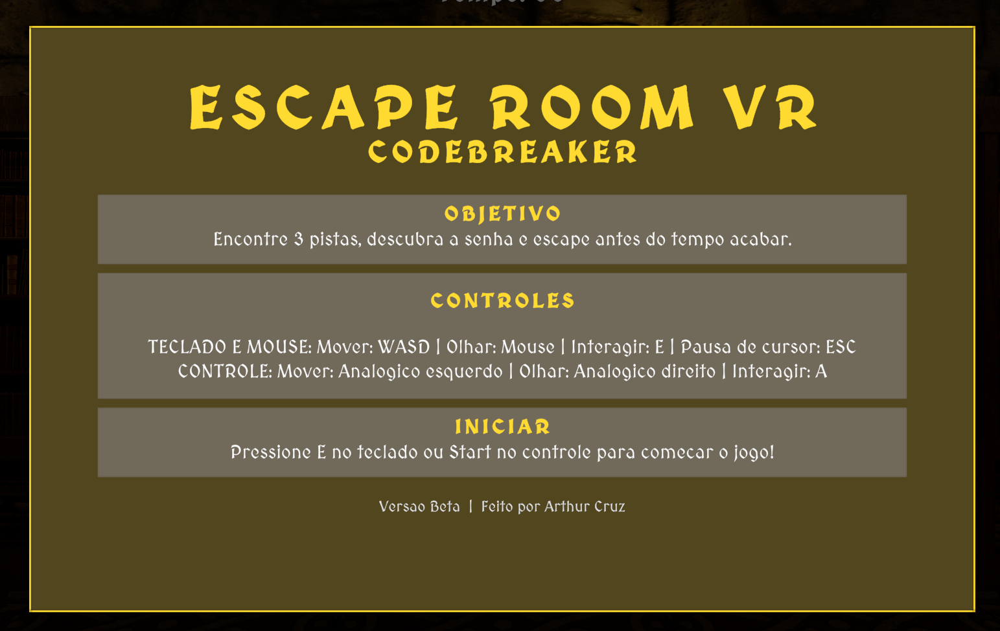
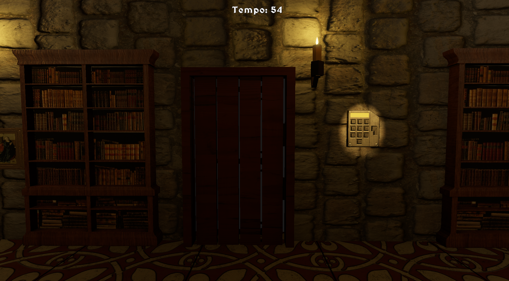
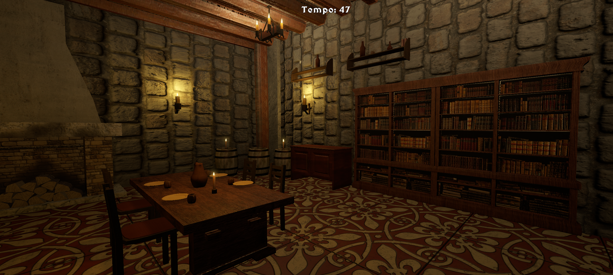
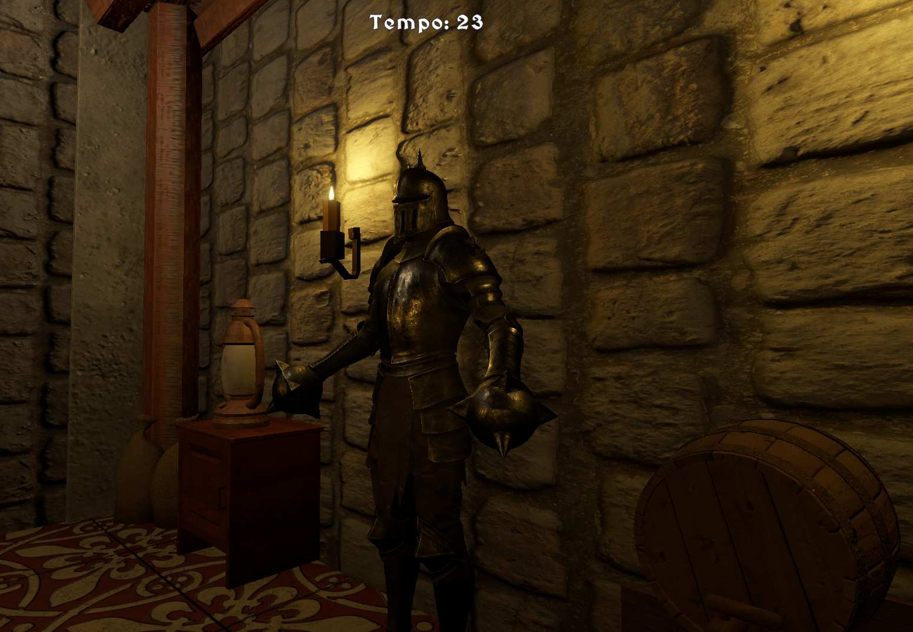

# Escape Room VR

Jogo de escape room em primeira pessoa, desenvolvido na Unity.

## Sobre o jogo

Encontre 3 pistas numéricas espalhadas pela sala, descubra a senha correta e escape antes do tempo acabar.

## Plataformas e controle

- Jogável atualmente em **desktop**
- Suporte a **teclado e mouse**
- Suporte a **controle de videogame**
- Adaptação completa para **VR** planejada para versões futuras

## Como jogar

1. Acesse a aba **Releases**
2. Baixe o arquivo `EscapeRoom_v1.0.zip`
3. Extraia os arquivos
4. Execute `EscapeRoomVR_CodeBreaker.exe`

## Como abrir no Unity

1. Abra no Unity Hub
2. Use a versão `6000.4.3f1`
3. Abra a cena `Assets/Scenes/SampleScene.unity`
4. Pressione Play

## Controles

- **Movimentação:** `WASD` / analógico esquerdo
- **Olhar câmera:** mouse / analógico direito
- **Interagir:** `E` (teclado) ou botão de ação no controle
- **Reiniciar (após fim):** `R`

## Screenshots do jogo

## Estrutura principal

- `Assets/Scripts/` - lógica principal de gameplay
- `Assets/Keypad/Scripts/` - scripts do keypad
- `Packages/` - dependências do projeto
- `ProjectSettings/` - configurações do Unity
